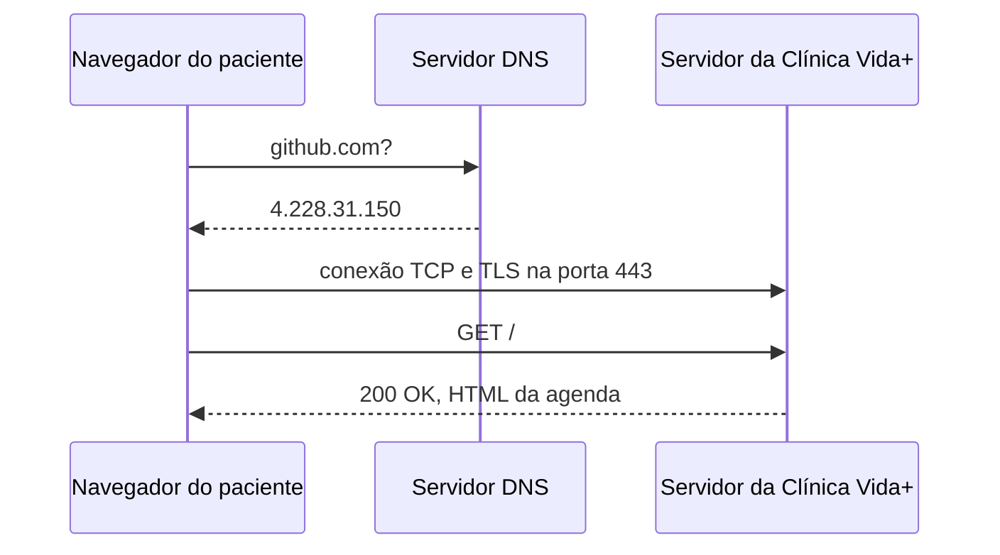

## O caminho de uma requisição



## Evidência do DNS

```text
C:\Users\Aluno>nslookup github.com
Servidor:  ns3.uninove.br
Address:  186.251.39.123

Não é resposta autoritativa:
Nome:    github.com
Address:  4.228.31.150

C:\Users\Aluno>ping github.com

Disparando github.com [4.228.31.150] com 32 bytes de dados:
Resposta de 4.228.31.150: bytes=32 tempo=5ms TTL=111
Resposta de 4.228.31.150: bytes=32 tempo=5ms TTL=111
Resposta de 4.228.31.150: bytes=32 tempo=8ms TTL=111
Resposta de 4.228.31.150: bytes=32 tempo=5ms TTL=111
```

## Evidência do HTTP

| Método | Recurso | Status | Content-Type |
| :--- | :--- | :--- | :--- |
| GET | `https://github.com/` | 200 OK | text/html; charset=utf-8 |
| GET | `.../85976.e32c4d5d85b74484.module.css` | 200 OK | text/css |
| GET | `.../chunk-49509-af191ad116e4a11.js` | 200 OK | application/javascript |
| GET | `https://github.com/pagina-que-nao-existe` | 404 Not Found | text/html; charset=utf-8 |

## Necessidade do HTTPS

O formulário de agendamento precisa do protocolo HTTPS para proteger o envio de dados sensíveis, como o **CPF do paciente** e dados da consulta. Sem a criptografia via TLS, essas informações trafegam em texto limpo pela rede e podem ser interceptadas. O HTTPS garante que a comunicação entre o navegador e o servidor seja privada e segura.